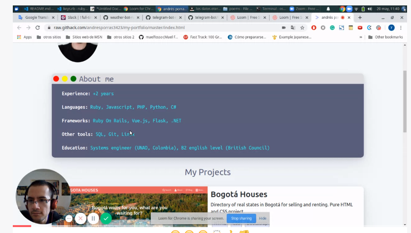

# MY-PORTFOLIO

# What it does

- Provides basic information about my professional skills, my experience and my education.
- Show some of my best projects, each one with live demo and github link.
- Links to my socials networks.

# Features

- SPA made with Vue.js.
- Using three different Google fonts.
- Using Bootstrap for the layout.
- Using Fontawesome for the icons to the social networks.

## Built With

- HTML5.
- CSS3.
- Bootstrap.
- Font-awesome.
- Google fonts.
- Vue.js.
- JavaScript.

#### and deployed to GitHub

## Future features

[Upcomming features for my portfolio](https://github.com/andresporras3423/my-portfolio/issues)

## Unit tests

[Unit tests](https://github.com/andresporras3423/my-portfolio/issues/3)

## Live Version

[Live](https://andres-porras-portfolio.netlify.app/)

## Project Presentation (VIDEO)

[presentation](https://www.loom.com/share/c5492c8765374b67af893cb578cf8aac)

## Authors

**Oscar Russi**
- Github: [@andresporras3423](https://github.com/andresporras3423/)
- Linkedin: [Oscar Russi](https://www.linkedin.com/in/oscar-andres-russi-porras/)
- Twitter: [@OscarRussi1](https://twitter.com/OscarRussi1)

## 🤝 Contributing

This is a project for educational purposes only. We are not accepting contributions.

## Attributions and Credit

Special thanks to Microverse, for this learning opportunity. 

## Show your support

Give a ⭐️ if you like this project!

## Enjoy!
